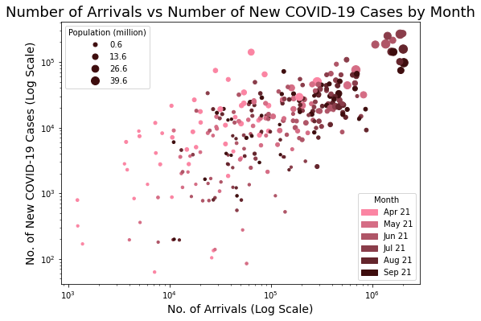
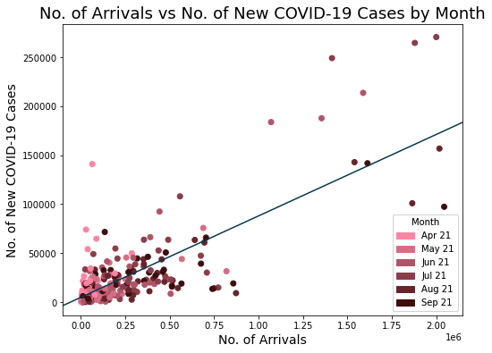
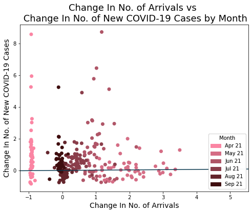
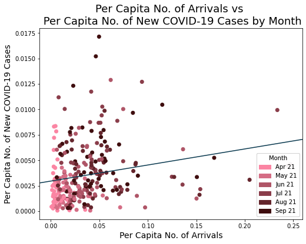
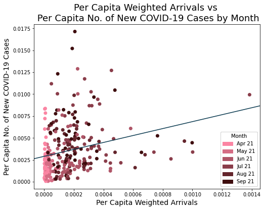
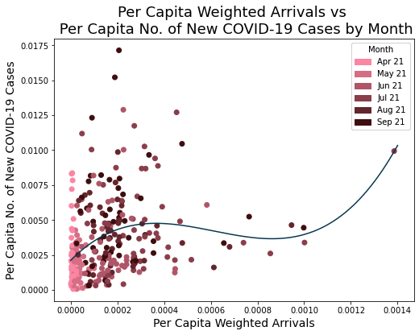
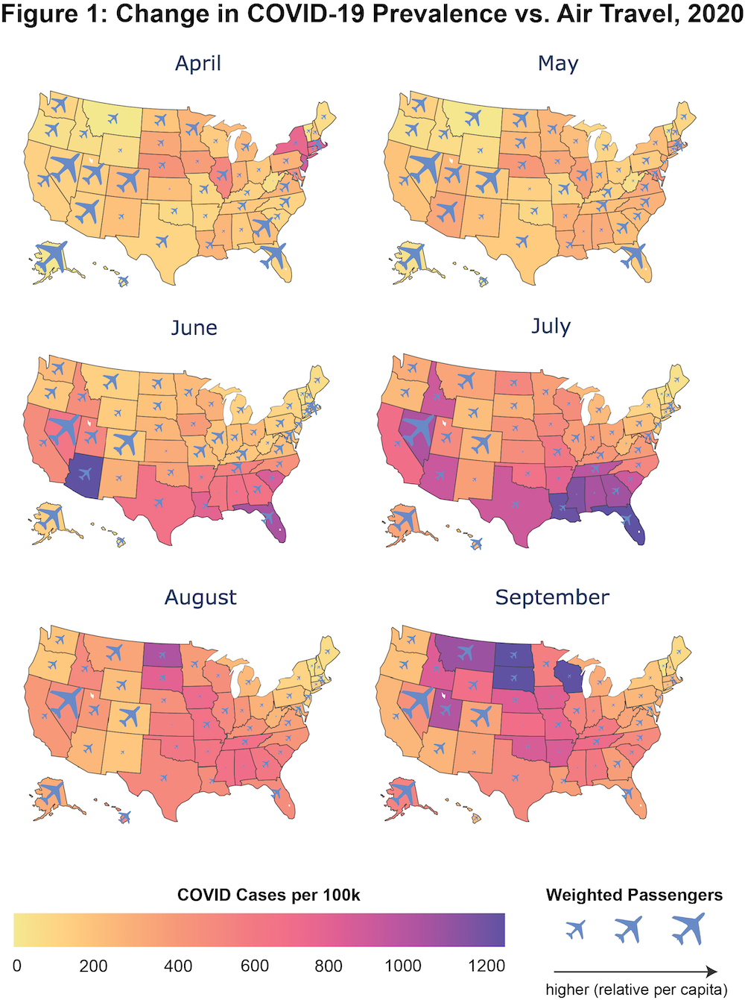

# Tech Report
This is where you can type out your tech report.

#### A defined hypothesis or prediction task, with clearly stated metrics for success.

A higher number of air passenger arrivals in a US state in a month is positively correlated with a higher number of new COVID-19 cases.

#### Why did you use this statistical test or ML algorithm? Which other tests did you consider or evaluate? How did you measure success or failure? Why that metric/value? What challenges did you face evaluating the model? Did you have to clean or restructure your data?

We used several regression models, namely simple linear regression, polynomial regression, multiple linear regression, and fixed effects, as we would like to determine the relationship between our predictor, the number of arrivals, and a continuous dependent variable, the number of COVID-19 cases. For all our models, we measured the success or failure by looking at the p-value to see if our null hypotheses can be rejected, and the R-squared value to determine how well the independent variables explain the variance in the dependent variables.

**Data Processing**

As our air passenger arrival data is only available by the month, we aggregated our daily COVID-19 data by months as well. Given the 14-day incubation period for COVID-19 between exposure to the virus and symptom onset, we summed up the number of new COVID-19 cases from the 15th of each month to the 15th of the next month as the total number of cases for the first month.

**Data Exploration**

We created a scatter plot of the data to explore the data and get some intuition on the appropriate model to use. We used log scale on both axis to allow easier visualization as most of the data points are crowded around the lower values. The data points for different states are sized according to the states' populations, and colored according to the months of the data.

Our key takeaways from the visualization are:
1. As expected, states with larger populations have more air passenger arrivals and COVID-19 cases, meaning that population is likely a causal factor for both. To study the relationship between air passenger arrivals and COVID-19 cases alone, we therefore need to remove the impact of population and scale the variables by the state population.
2. The linear relationship shown in the log-log plot suggests that there might be a polynomial rather than linear relationship between the independent and dependent variables.
3. Both air passenger arrivals and COVID-19 cases appear to increase with time from Apr 2020 to Sep 2020.

**Simple Linear Regression**

We first ran a simple linear regression model with only one predictor to have a simple model as our base analysis. We tested different variations of our X and Y variables:

1. **Model 1a** - Absolute number of air passenger arrivals vs absolute number of new COVID-19 cases
2. **Model 1b** - Change in number of air passenger arrivals vs change in number of new COVID-19 cases
    * We calculated the percentage change in the variables as one possible way to control for the population.
3. **Model 1c** - Per capita number of air passenger arrivals vs per capita number of new COVID-19 cases
    * We divided the variables by the population of the state as another way to control for the population.
3. **Model 1c(w)** - Per capita weighted arrivals vs per capita number of new COVID-19 cases
    * We created this model based on the intuition that having more flights from states with higher numbers of COVID-19 cases will be correlated with a higher number of COVID-19 cases in the destination state, as compared to having the same number of flights from states with lower numbers of COVID-19 cases.
    * We weighted the number of arrivals by multiplying the number of flights from each origin state with the origin state's per capita number of COVID-19 cases, before summing them up by the destination state.
    * We took the per capita value of this weighted number to control for the population.
    * This model gives the best result out of Models 1b-c, and serves as the base model for the more complicated models below.

**Model 2 - Polynomial Regression**

* Based on the initial scatter plot of our data, we believe that there may exist a non-linear correlation between X and Y. Additionally, studies show that an infectious disease such as COVID-19 can potentially spread in an exponential manner (https://www.pnas.org/content/117/28/16264), thus we decided that it is worth investigating if a polynomial model would perform better than our simple linear model.
* For us to decide on what is the optimal degree of X that we should use for the polynomial equation, we fitted the examples to a polynomial curve of degree k, where k = {1,...,9} and calculated the R-squared values of the fitted model. From our calculations, the R-squared value increases quickly up to about degree k=3 before plateauing. Thus, we decided to implement this model with X up to the 3rd power.
* We effectively ran the polynomial regression model as a multiple linear regression, but with the variables X^3, X^2, X, and a constant term. This meant that we could continue to use the OLS library functions to perform the regression.

**Model 3 - Multiple Linear Regression**
* We believe that the COVID-19 restrictions of states are correlated with the number of COVID-19 cases, so we implemented a multiple regression model that includes additional regressors such as mask mandate, business closure, stay-at-home orders and quarantine mandates to control .
* The main challenge in preparing our data for this model was that since our flight data was in terms of state followed by the month, i.e. AK for the month of April had x flights, we needed our policy data to indicate for each month whether a particular state had a policy enacted. However, our policy data initially contained the start and end datetimes for a certain policy in each state. To translate the data into our desired format, we had to parse the datetimes and round them to months, then check for a certain month if a policy is in effect or not. If it is in effect, we set that policy’s value to 1 for that month, and 0 otherwise.

**Model 4 - Fixed Effects**

* One of the main challenges in investigating the hypothesis is the presence of substantial omitted variable bias, as it is impossible to account for all the factors that affect the number of positive covid-19 cases of different US states. Statewide public health policies, healthcare infrastructure, social/political attitudes towards the pandemic may be correlated with the number of COVID-19 cases, and if so will lead to omitted variable bias. Additionally some of these factors might be very hard or even impossible to measure. An fixed effects regression model, in theory, is able to control omitted variables in panel data that vary across entities (states) but not over time (eg. Healthcare infrastructure, social/political norms).
* We implemented two fixed effects regression models (one is fixed-entity, the other is entity time-fixed), and the goal is to derive an OLS estimate of the coefficient of the independent variable (per capita weighted arrivals) for the hypothesis test.

#### What is your interpretation of the results? Do accept or deny the hypothesis, or are you satisfied with your prediction accuracy? For prediction projects, we expect you to argue why you got the accuracy/success metric you have. Intuitively, how do you react to the results? Are you confident in the results?

**Simple Linear Regression**

Here we will discuss the performance of the 4 different X variables we tested:

1. **Model 1a** - Absolute number of air passenger arrivals vs absolute number of new COVID-19 cases
    * The OLS estimate of the linear regression model is Y = 0.0831X + constant. This model caused us to obtain a high R^2 value of 0.611 and a p-value of < 0.01.  The p-value is less than 0.05, so the null hypothesis is rejected at the 5% level.
2. **Model 1b** - Change in number of air passenger arrivals vs change in number of new COVID-19 cases
    * The OLS estimate of the linear regression model is Y = -0.0948X + constant. This model caused us to obtain a R^2 value of 0.005. The p-value is more than 0.05 at 0.208, so the null hypothesis is not rejected.
3. **Model 1c** - Per capita number of air passenger arrivals vs per capita number of new COVID-19 cases
    * The OLS estimate of the linear regression model is Y = 0.0158X + constant. This model caused us to obtain a R^2 value of 0.047 and a p-value of 0.0158.  The p-value is less than 0.05, so the null hypothesis is rejected at the 5% level.
3. **Model 1c(w)** - Number of new COVID cases per capita against weighted number of inbound flight passengers per capita (weighing method described above)
    * The OLS estimate of the linear regression model with a single regressor is as follows: Y = 3.96*X + constant. This model caused us to obtain a R^2 value of 0.065 and a p-value of <0.01. The p-value is less than 0.05, so the null hypothesis is rejected at the 5% level.

While we can see that model 1a has the highest R^2 value, it is likely inaccurate because the population of a state directly influences both the number of COVID-19 cases and the number of flight passengers. Thus we chose to not use absolute numbers for our subsequent analyses.

Model 1b performed poorly likely due to the fact that the calculation of the percentage change in both variables resulted in different data points being highly dependent, which makes the data poorly suited for regression.

From the other regressions, we can see that model 1c(w) performed the best in terms of R^2 value. Therefore, for all subsequent analyses, we used the per capita weighted number of arrivals against the per capita number of COVID-19 cases.

**Polynomial Regression**

* Increasing the degree of the polynomial curve results in an increase of the R-squared values, but the improvement plateaus at k = 3. We decided to use k=3 as our model as we would like to avoid overfitting to the data.
* The OLS estimate of the non-linear regression model is as follows: Y = 16.95*X - 3.304e4*X^2 + 1.795e7*X^3 + constant. Each of the polynomial terms is statistically significant at the 5% level, so the null hypothesis is rejected. The R^2 value for non-linear regression with degree 3 is 0.118.
* Since there is a higher R^2 value as compared to the linear simple regression model (0.118 vs 0.065), we can say that it is likely that the number of new COVID-19 cases per capita varies exponentially with the weighted number of inbound flight passengers per capita.

**Multiple Linear Regression**
* The OLS estimate of the multiple regression model is as follows: Y = 1.9856\*X - 0.001\*stay_at_home - 0.0009\*business_closure - 0.0005\*facemask_mandate -0.0019\*quarantine_mandate + constant.
* Only the coefficients of X and stay-at-home mandate are statistically significant at the 5% level, so the null hypothesis is rejected. It makes sense that the public health policies are negatively correlated with Y, even though their coefficient magnitudes are small. This model produces a better fit for the data set as compared to the simple linear regression model, as the R^2 value is 0.211.
* We can clearly see that by taking into account the effect of policies, we have reduced the omitted variable bias, and improved the fit of the model.

**Fixed Effects**
* The OLS estimate of the fixed effects regression line relating the per capita weighted number of inbound air travelers, X, to the increase in positive COVID-19 cases, Y, is as follows: Y = 1.1459*X + policy dummy variables + state fixed effects. The coefficient of X is not statistically significant at the 5% level, so the null hypothesis cannot be rejected. The R^2 value is 0.2743.
* Adding time fixed effects to the fixed-effects regression model makes little changes to the results, as the coefficient value of the variable of interest is the same. A rationale for this analysis is to see whether our data is able to absorb some federal US government policies that are implemented nationwide, such as coronavirus aid relief or travel requirements for international travelers from high-risk countries. So an interpretation of this result can be that there is no significant omitted variable bias arising from unobserved variables that are constant across states.

#### For your visualization, why did you pick this graph? What alternative ways might you communicate the result? Were there any challenges visualizing the results, if so, what where they? Will your visualization require text to provide context or is it standalone (either is fine, but it's recognize which type your visualization is)?

**Regression Plots**

To visualize the results of our regression models, we created several regression plots:

1. **Model 1a** - Absolute number of air passenger arrivals vs absolute number of new COVID-19 cases

2. **Model 1b** - Change in number of air passenger arrivals vs change in number of new COVID-19 cases

3. **Model 1c** - Per capita number of air passenger arrivals vs per capita number of new COVID-19 cases

3. **Model 1c(w)** - Per capita weighted arrivals vs per capita number of new COVID-19 cases

4. **Model 2** - Polynomial Regression

* The regression plots showing the scatter plot of the data points and the regression line that is fitted by the model allows us to visually evaluate the performance of the model. We can tell for instance that Model 1b is a poor model, as the variance of the independent variable is large for the same dependent variable. As a whole, we can see that models 1b, 1c, 1c(w) and 2 do not fit the data points that well, explaining the low R-squared values of these models.  

**Map**

* We picked a map for our visualization because our data is inherently geographically, thus lending itself well to the idea of a map. Because the goal of our project is to identify correlation between air travel and COVID rates, we determined the best way to do this was a dual choropleth / bubble map that represents two types of data. The shading of each state represents the number of COVID cases per 100,000 residents while the size of the plane icon above each state represents the number of weighted passengers arriving. In summary, the graph allows for easy visual intuition of the question we are trying to answer: does air travel lead to higher rates of COVID? We picked this graph because we could easily show both the dependent and independent variable on one graph for any given month, which was our goal. Maps are also easily digestible and quite aesthetically appealing!
* We could also have plotted these results as a scatter plot, potentially labelling each different point as a different state in a given month. But this would have been significantly messy if we labelled the states, or otherwise would leave out important geographical links from our visualization. As a result, a map was far and away the best possible option for this visualization.
* The main challenge in producing the map was making it work aesthetically -- there is no easy way to create subplots of choropleth maps in Plotly (the Python package used to create our visualizations), requiring use of Adobe Illustrator to properly construct the visualization. As Plotly was new to me, there was somewhat of a learning curve as I learned how to tune the visualization to its desired form given the limitations of the software. Another challenge was displaying all the information we hoped to show without cluttering the figure; we believe this was achieved successfully due to our tasteful use of colors, airplane images for overlaid the bubble map, and overall row/column design of the figure.
* While the specific metrics of the visualization might require explanation (i.e. what is a weighted passenger per capita?) the overall message is clear -- a larger plane intuitively suggests more arriving passengers, whereas a darker color suggests higher rates of COVID. Most viewers would be able to intuitively understand this visualization because while the metrics themselves might require explanation, the underlying message is clear and is easily observable by the untrained eye.

#### If you did a statistics test, are there any confounding trends or variables you might be observing?

* We are surprised to find that the coefficient on X for the multiple regression model and the fixed effects model are in fact higher than that in the linear regression model with a single regressor. In theory, when more independent variables are added the coefficient magnitude of X should be lower.   
* Another interesting observation of the fixed-effects model is that the additional variables associated with state policies such as face mask mandates and quarantine mandates actually have more significant explanatory power for the increase in positive Covid-19 cases than the number of inbound air travelers. For instance if the binary variable quarantine mandate is true, then the increase in positive Covid-19 cases decreases by 3823.4. Confoundingly according to the model implementing mask mandate for a particular month increases the increase in positive Covid-19 cases by 639.11! However it is noted that the joint hypothesis that the coefficients on all of the additional variables is 0 cannot be rejected at the 5% level.

#### Discussion of visualization/explaining your results on a poster and a discussion of future directions.

* An issue that we did not address in our analysis is the fact that it is very likely that causality runs in both directions - the number of inbound flight passengers impacts the number of positive Covid-19 cases, and vice-versa. When simultaneous causality bias arises, multiple regression and fixed effects models simply cannot eliminate the bias. Given more time we would love to implement an instrumental variable regression model for our analysis, as it can generally obtain a consistent estimator of the unknown causal coefficients when the regressors are correlated with the error term. 

* A potentially interesting extension for our project is to explore the relationship between international flight volume/national border restrictions and the spread of Covid-19 for specific country(ies). As the pandemic spread globally in 2020, many governments decided to shut down national borders in some shapes or forms. Intuitively strict border lockdowns may provide clearer flight passenger impacts than what we see in our current analysis for US states. Looking at certain countries that implemented strict border closures early on and saw limited local community spread of COVID-19, such as Singapore or Taiwan might allow us to investigate how effective border closures are as a measure to fight pandemics.
